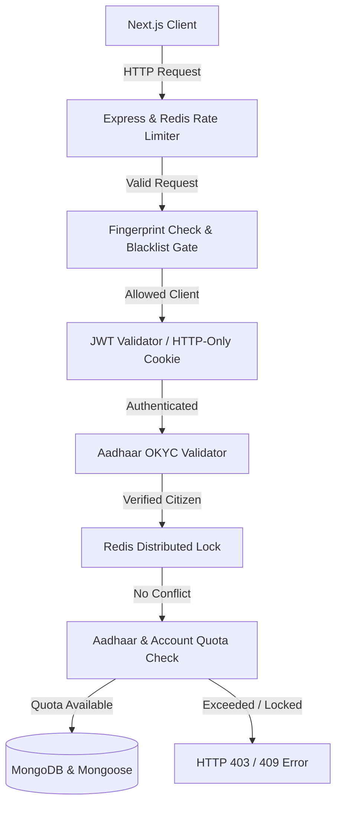

# 🚇 YatraSetu (यात्रासेतु)

### **Official Digital Portal — Government of India / Official Railway Initiative**

YatraSetu is a state-of-the-art, high-performance, and secure digital platform built to modernize and streamline railway ticket booking in India. Designed with strict security architectures, modern centered layouts, and robust system designs, YatraSetu integrates authenticated Aadhaar OKYC, real-time IRCTC train APIs, dynamic ticket quota enforcement, and concurrency controls to prevent booking conflicts.

---

## 📖 Table of Contents
1. [Key Features](#-key-features)
2. [Tech Stack](#%EF%B8%8F-tech-stack)
3. [System Architecture & Security Model](#-system-architecture--security-model)
4. [Detailed User Flow](#-detailed-user-flow)
5. [Project Structure](#-project-structure)
6. [Environment Variables Config](#-environment-variables-config)
7. [Local Installation & Run Guide](#-local-installation--run-guide)
8. [Testing & Verification](#-testing--verification)

---

## 🌟 Key Features

### 🖥️ Modern Centered UI & UX
* **Government Identity & Trust**: Integrated Ashoka Emblem badge and verified government styling.
* **Glassmorphic Unified Navbar**: Centered viewport links, dynamic route displays, auto-collapsing profiles, and interactive icons with micro-animations.
* **Responsive Layouts**: Centered layouts on wide screens (`max-width: 1280px` for main pages, `760px` for bookings lists, and `640px` for passenger checkouts).
* **Mobile-First Elements**: Bottom sheets for mobile filters, side-sliding drawers for tablets, and horizontally scrollable tab controls.

### 🛡️ Industrial-Grade Security
* **Double-Layer Rate Limiting**: Express-rate-limiting prevents server resource abuse, while Redis keeps track of high-volume requests in real-time.
* **Device Fingerprinting**: Captures and SHA-256 hashes device credentials (IP + User Agent) to enforce device bans and detect malicious bot traffic.
* **Identity Verification (Aadhaar OKYC)**: Authenticates real citizens via a secure two-step Aadhaar verification gateway using Sandbox.co.in.
* **Salted Aadhaar Hashes**: To prevent double-account creations, the backend stores only a salted SHA-256 hash of the Aadhaar number—ensuring compliance with privacy laws.

### 🚄 Real-Time Train Information
* **IRCTC Proxy Gateway**: Live stations autocomplete, train lists, seat availability checking, fare calculation, schedules, and active PNR statuses proxied directly from IRCTC RapidAPI.

### 🔒 Concurrency & Quota Management
* **Distributed Locks**: Uses Redis locking (30-second TTL) on `eventId-seat` combinations to prevent race conditions during ticket checkouts.
* **Ticket Quotas**: Enforces strict limits on event bookings (maximum of 4 tickets per Aadhaar and 6 tickets per user account).

---

## 🛠️ Tech Stack

### Frontend
* **Framework**: [Next.js 16 (React 19)](https://nextjs.org/) using App Router structure.
* **Styles**: Vanilla CSS & [Tailwind CSS v4](https://tailwindcss.com/) for fluid layout design.
* **Icons**: [Lucide React](https://lucide.dev/) for responsive vector icons.

### Backend
* **Runtime**: [Node.js](https://nodejs.org/) & [Express](https://expressjs.com/) built with [TypeScript](https://www.typescriptlang.org/).
* **Database**: [Mongoose](https://mongoosejs.com/) (MongoDB Atlas) for profile and ticket storage.
* **Cache & Memory Lock**: [Redis / ioredis](https://redis.io/) for rate limits, session tokens, OTP validation, and distributed locks.
* **Mailing**: [Nodemailer](https://nodemailer.com/) / AWS SES for registration OTPs and security alerts.

### APIs & Integrations
* **Identity Gate**: [Sandbox.co.in](https://sandbox.co.in) Aadhaar OKYC API.
* **Rail API**: IRCTC API on [RapidAPI](https://rapidapi.com).

---

## 🧱 System Architecture & Security Model



1. **Rate Limiting**: Users are locked to 10 requests per 15 minutes for security routes, and 100 requests per minute globally using Redis.
2. **Double-Booking Prevention**: When booking, a Redis key `lock:booking:<eventId>:<seat>` is set. If another request attempts to book the same seat before the lock expires (30s) or the transaction completes, it receives an HTTP 409 Conflict.
3. **Data Anonymization**: The database holds `aadhaarHash` computed as `sha256(aadhaarNumber + AADHAAR_SALT)`. The raw Aadhaar is immediately discarded and never logged or stored.

---

## 🔄 Detailed User Flow

### Phase 1: Sign Up & Email Verification
1. **Details Input**: User visits `/register` and fills in username, fullName, email, mobile, and password.
2. **OTP Generation**: Backend saves the user in MongoDB as unverified, generates a 6-digit OTP, stores it in Redis (10-minute expiry), and mails it to the user.
3. **Email OTP Verification**: User enters the OTP. Backend verifies it, updates user to `isEmailVerified: true`, signs a JWT access token, sets an HTTP-only refresh token, and logs the user in automatically.

### Phase 2: Aadhaar OKYC Identity Onboarding
1. **Consent & Input**: User inputs their 12-digit Aadhaar number and accepts the consent checkbox on `/register/identity-verification`.
2. **Generate Aadhaar OTP**: Backend sends the request to Sandbox.co.in, which requests UIDAI to send an OTP to the citizen's Aadhaar-linked mobile. Sandbox returns a `reference_id` which the backend stores in Redis.
3. **Verify Aadhaar OTP**: User submits the Aadhaar OTP. Backend calls Sandbox to verify it. Upon validation, the backend hashes the Aadhaar number, updates the user's profile to `isAadhaarVerified: true`, and links the hash to the profile.

### Phase 3: Searching & Browsing Trains
1. **Search Parameters**: User enters origin, destination, and journey date. Autocomplete matches station codes (e.g. NDLS, BCT).
2. **List & Filters**: Next.js renders the matches. Users filter by departure timings, class type, and quota.
3. **Check Availability**: User queries real-time seats and ticket fares.

### Phase 4: Journey Confirmation & Booking
1. **Passenger Details**: User fills out the passenger details form (constrained to `640px` width).
2. **Pre-Booking Checks**:
   * Fingerprint check evaluates if the user's client is flagged.
   * Quota checks verify the user has booked < 6 tickets for this event, and the linked Aadhaar hash has booked < 4 tickets.
3. **Checkout Transaction**: Redis distributed lock is acquired for the seat. If successful, the ticket is generated, saved in MongoDB, and the seat is booked.

---

## 📁 Project Structure

```
Yatrasetu/
├── README.md                 # Project Overview & Guide (Root)
├── backend/                  # Node.js/Express API Gateway
│   ├── src/
│   │   ├── config/           # DB, Redis, and Mail configurations
│   │   ├── middleware/       # Auth, Rate limits, Fingerprints, and Gates
│   │   ├── models/           # Mongoose schemas (User, Ticket, Event)
│   │   ├── routes/           # Auth, Profile, Tickets, and Train routes
│   │   └── server.ts         # Main Application Entry point
│   ├── package.json          # Node dependencies
│   └── tsconfig.json         # TS configurations
└── frontend/                 # Next.js Application Client
    ├── src/
    │   ├── app/              # Router (Browse, Book, Bookings, Register)
    │   ├── components/       # Shared UI components (Navbar, Modal)
    │   └── lib/              # Client API wrapper and helpers
    ├── package.json          # Next.js dependencies
    └── tailwind.config.ts    # Tailwind styling config
```

---

## ⚙️ Environment Variables Config

### Backend Configuration (`backend/.env`)
Create a `.env` file inside the `backend/` folder:
```env
PORT=5000
NODE_ENV=development
MONGODB_URI=mongodb+srv://<username>:<password>@cluster.mongodb.net/yatrasetu
ALLOWED_ORIGINS=http://localhost:3000
FRONTEND_URL=http://localhost:3000
REDIS_URL=redis://127.0.0.1:6379

# JWT Secrets
JWT_SECRET=super_long_and_extremely_secure_jwt_access_secret_key_123!
JWT_REFRESH_SECRET=super_long_and_different_secure_jwt_refresh_secret_key_456!

# Aadhaar Hash Salt (Never change once set in production)
AADHAAR_SALT=my_secure_aadhaar_hashing_salt_value_98765

# SMTP Config (AWS SES)
SMTP_HOST=email-smtp.ap-south-1.amazonaws.com
SMTP_PORT=587
SMTP_USER=YOUR_SES_SMTP_USERNAME
SMTP_PASS=YOUR_SES_SMTP_PASSWORD
EMAIL_FROM=noreply@yourdomain.com
EMAIL_FROM_NAME="YatraSetu Support"

# Sandbox.co.in Credentials
SANDBOX_API_KEY=sbx_pk_abcdef1234567890
SANDBOX_API_SECRET=sbx_sk_9876543210fedcba

# RapidAPI IRCTC Credentials
RAPIDAPI_KEY=your_rapidapi_subscription_key_here
RAPIDAPI_HOST=irctc1.p.rapidapi.com
```

### Frontend Configuration (`frontend/.env.local`)
Create a `.env.local` file inside the `frontend/` folder:
```env
NEXT_PUBLIC_API_URL=http://localhost:5000
```

---

## 🚀 Local Installation & Run Guide

### Prerequisites
* **Node.js** (v18 or higher recommended)
* **MongoDB** (Local instance or MongoDB Atlas cluster)
* **Redis** (Local instance running on `6379`)

### 1. Set Up the Backend
```bash
cd backend
npm install
# Compile TypeScript to dist/
npm run build
# Start development server with Nodemon & tsx
npm run dev
```

### 2. Set Up the Frontend
```bash
cd frontend
npm install
# Run Next.js in development mode
npm run dev
```
Open [http://localhost:3000](http://localhost:3000) in your browser to view the application.

---

## 🧪 Testing & Verification

### Run Backend Unit & Integration Tests
The backend uses Jest. To execute:
```bash
cd backend
npm run test
```

### Run TypeScript Verification
To check type safety across the codebases:
```bash
# Backend
cd backend
npm run typecheck

# Frontend
cd frontend
npx tsc --noEmit
```
