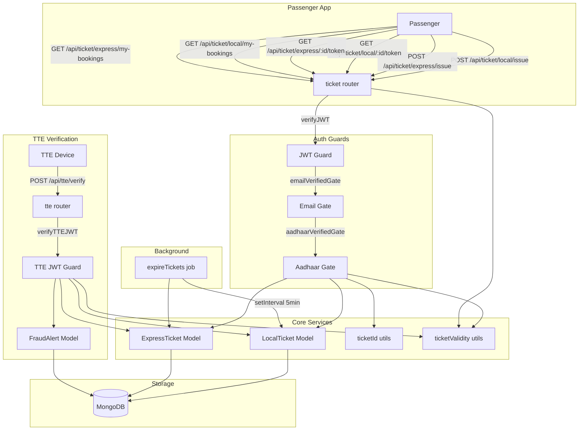
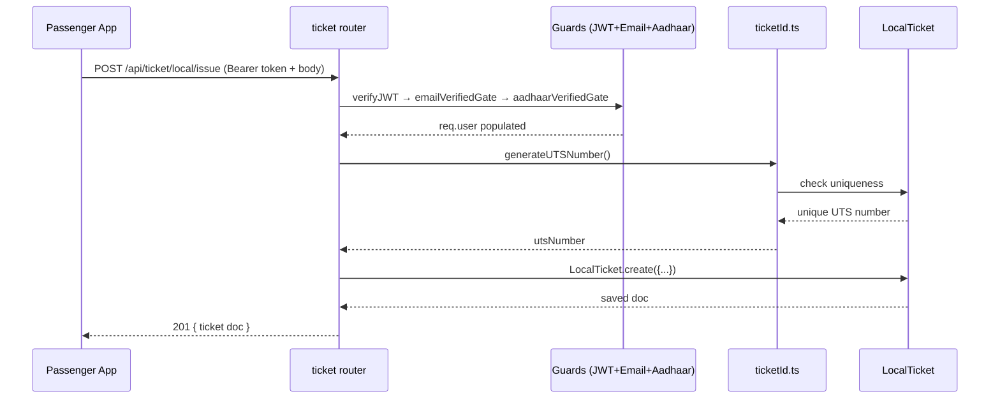
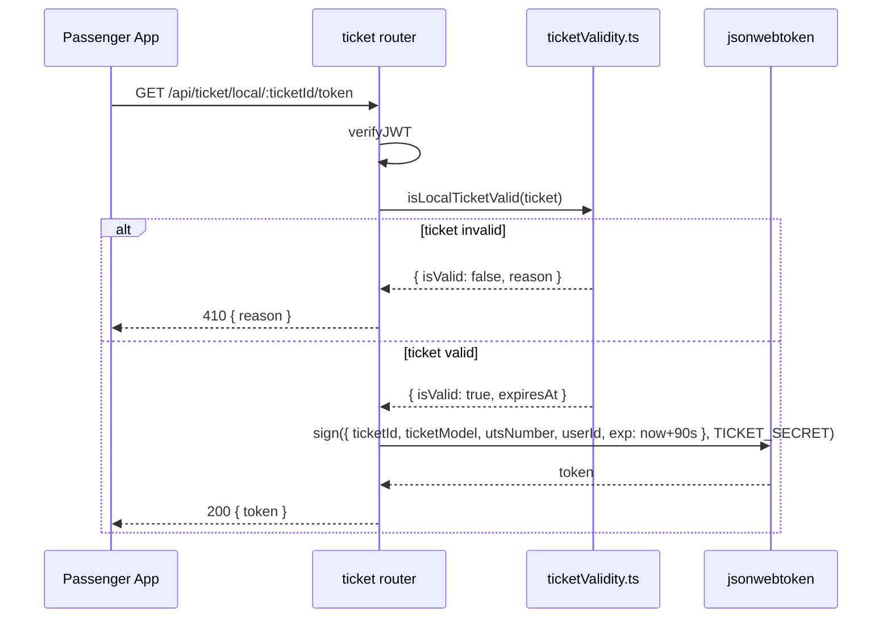
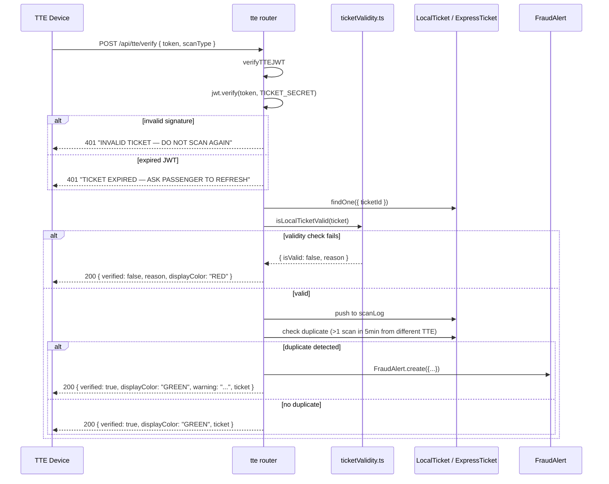

# Design Document: Digital Ticket System

## Overview

The Digital Ticket System enables passengers to purchase, view, and present digital railway tickets (both local/suburban UTS tickets and express/long-distance PNR tickets) within the Yatrasetu app. Ticket Travelling Examiners (TTEs) can scan a short-lived QR token to verify ticket authenticity, check validity, and detect duplicate/fraudulent scans in real time.

The system introduces two new Mongoose ticket models (`LocalTicket`, `ExpressTicket`), a fraud-logging model (`FraudAlert`), cryptographic ID generators, an IST-aware validity engine, a separate TTE JWT middleware, all route handlers, and a background expiry job — all wired into the existing Express 5 / TypeScript / MongoDB / Redis stack.

## Architecture



## Sequence Diagrams

### Passenger Issues a Local Ticket



### Passenger Fetches QR Token



### TTE Scans a Token



## Components and Interfaces

### Component 1: LocalTicket Model (`src/models/LocalTicket.ts`)

**Purpose**: Mongoose model representing suburban/local UTS tickets.

**Interface**:
```typescript
interface IScanLogEntry {
  scannedAt: Date;
  scannedBy: string;  // TTE ID
  scanType: "VERIFICATION" | "ENTRY" | "EXIT";
}

interface IPassengerCount {
  adults: number;   // min 1
  children: number; // default 0
}

interface ILocalTicket extends Document {
  ticketId: string;           // UUID, unique
  utsNumber: string;          // X0 + 8 uppercase alphanumeric
  userId: Types.ObjectId;     // ref User
  passengerCount: IPassengerCount;
  fromStation: string;
  toStation: string;
  viaStation?: string;
  distanceKm: number;
  ticketType: "ONE_WAY" | "RETURN";
  class: "SECOND" | "FIRST";
  fare: number;
  purchasedAt: Date;
  journeyCommencedAt: Date | null;
  journeyCompletedAt: Date | null;
  status: "ACTIVE" | "USED" | "EXPIRED" | "CANCELLED";
  scanLog: IScanLogEntry[];
  createdAt: Date;
  updatedAt: Date;
}
```

**Responsibilities**:
- Persist local ticket data with Mongoose schema validation
- Enforce unique index on `ticketId` and `utsNumber`
- Store scan audit trail in `scanLog`

---

### Component 2: ExpressTicket Model (`src/models/ExpressTicket.ts`)

**Purpose**: Mongoose model representing express/long-distance reserved and unreserved tickets.

**Interface**:
```typescript
interface IExpressPassenger {
  name: string;
  age: number;
  gender: "M" | "F" | "T";
  seat: string;
  coach: string;
  berthType: string;
  status: "CNF" | "WL" | "RAC" | "GNWL";
}

interface IExpressTicket extends Document {
  ticketId: string;
  pnrNumber: string;          // unique 10-digit numeric string
  userId: Types.ObjectId;
  trainNo: string;
  trainName: string;
  fromStation: string;
  toStation: string;
  journeyDate: Date;
  departureTime: string;      // HH:MM
  arrivalTime: string;
  distanceKm: number;
  ticketSubType: "RESERVED_ONE_WAY" | "RESERVED_RETURN" | "UNRESERVED_ONE_WAY";
  class: "SL" | "3A" | "2A" | "1A" | "CC" | "2S" | "GEN";
  quota: string;              // default "GN"
  passengers: IExpressPassenger[];
  fare: number;
  totalFare: number;
  purchasedAt: Date;
  returnJourneyDate: Date | null;
  returnTrainNo: string | null;
  ticketStatus: "ACTIVE" | "USED" | "EXPIRED" | "CANCELLED";
  scanLog: IScanLogEntry[];
  createdAt: Date;
  updatedAt: Date;
}
```

**Responsibilities**:
- Persist express ticket data including per-passenger berth assignments
- Support RESERVED_RETURN tickets with return journey metadata
- Store scan audit trail

---

### Component 3: FraudAlert Model (`src/models/FraudAlert.ts`)

**Purpose**: Records suspected duplicate/fraudulent ticket scan events for audit and investigation.

**Interface**:
```typescript
interface IFraudAlert extends Document {
  ticketId: string;
  ticketModel: "local" | "express";
  scannedAt: Date;
  tteId: string;
  previousScanAt: Date;
  previousTteId: string;
  createdAt: Date;
  updatedAt: Date;
}
```

---

### Component 4: ticketId Utilities (`src/utils/ticketId.ts`)

**Purpose**: Cryptographically generate unique ticket identifiers with MongoDB uniqueness guarantees.

**Interface**:
```typescript
async function generateUTSNumber(): Promise<string>
// Returns: "X0" + 8 uppercase alphanumeric chars (e.g. "X0A1B2C3D4")
// Checks LocalTicket collection for uniqueness before returning

async function generatePNR(): Promise<string>
// Returns: unique 10-digit numeric string
// Checks ExpressTicket collection for uniqueness before returning
```

**Algorithm**:
```typescript
async function generateUTSNumber(): Promise<string> {
  const CHARS = "ABCDEFGHIJKLMNOPQRSTUVWXYZ0123456789";
  while (true) {
    const bytes = crypto.randomBytes(8);
    const suffix = Array.from(bytes)
      .map(b => CHARS[b % CHARS.length])
      .join("");
    const candidate = "X0" + suffix;
    const exists = await LocalTicket.exists({ utsNumber: candidate });
    if (!exists) return candidate;
  }
}

async function generatePNR(): Promise<string> {
  while (true) {
    const bytes = crypto.randomBytes(6);
    const num = parseInt(bytes.toString("hex"), 16);
    const candidate = String(num % 10_000_000_000).padStart(10, "0");
    const exists = await ExpressTicket.exists({ pnrNumber: candidate });
    if (!exists) return candidate;
  }
}
```

---

### Component 5: ticketValidity Utilities (`src/utils/ticketValidity.ts`)

**Purpose**: Stateless IST-aware validity checks for both ticket types.

**Interface**:
```typescript
interface ValidityResult {
  isValid: boolean;
  reason: string;
  expiresAt: Date;
}

function isLocalTicketValid(ticket: ILocalTicket): ValidityResult
function isExpressTicketValid(ticket: IExpressTicket): ValidityResult
```

**IST helper**:
```typescript
function toIST(date: Date): Date {
  // Add +5:30 offset (330 minutes)
  return new Date(date.getTime() + 330 * 60 * 1000);
}

function istMidnight(date: Date): Date {
  const ist = toIST(date);
  ist.setHours(0, 0, 0, 0); // zeroes are in IST
  return new Date(ist.getTime() - 330 * 60 * 1000); // back to UTC
}
```

**Local ticket validity rules**:
```typescript
function isLocalTicketValid(ticket: ILocalTicket): ValidityResult {
  if (ticket.status !== "ACTIVE") {
    return { isValid: false, reason: `Ticket is ${ticket.status}`, expiresAt: ticket.purchasedAt };
  }

  const now = new Date();
  const purchased = ticket.purchasedAt;

  if (ticket.ticketType === "ONE_WAY") {
    const expiresAt = new Date(purchased.getTime() + 60 * 60 * 1000); // +1 hour
    if (now > expiresAt) return { isValid: false, reason: "Ticket has expired (1-hour window)", expiresAt };
    return { isValid: true, reason: "Valid", expiresAt };
  }

  // RETURN ticket
  const forwardExpiry = new Date(purchased.getTime() + 60 * 60 * 1000);
  // Return leg: midnight of next day after purchase in IST
  // Extended to Monday midnight if purchased on Friday or Saturday (IST)
  const purchasedIST = toIST(purchased);
  const dayOfWeek = purchasedIST.getDay(); // 0=Sun, 5=Fri, 6=Sat
  let returnExpiry: Date;
  if (dayOfWeek === 5) {
    // Friday → extend to Monday midnight IST
    returnExpiry = istMidnightOffsetDays(purchased, 3);
  } else if (dayOfWeek === 6) {
    // Saturday → extend to Monday midnight IST
    returnExpiry = istMidnightOffsetDays(purchased, 2);
  } else {
    // Next day midnight IST
    returnExpiry = istMidnightOffsetDays(purchased, 1);
  }
  const expiresAt = returnExpiry;
  if (now > expiresAt) return { isValid: false, reason: "Return ticket has expired", expiresAt };
  return { isValid: true, reason: "Valid", expiresAt };
}
```

**Express ticket validity rules**:
```typescript
function isExpressTicketValid(ticket: IExpressTicket): ValidityResult {
  if (ticket.ticketStatus !== "ACTIVE") {
    return { isValid: false, reason: `Ticket is ${ticket.ticketStatus}`, expiresAt: ticket.purchasedAt };
  }

  const now = new Date();

  if (ticket.ticketSubType === "RESERVED_ONE_WAY" || ticket.ticketSubType === "RESERVED_RETURN") {
    // Journey date (IST) must match today (IST)
    const todayIST = toIST(now);
    const journeyIST = toIST(ticket.journeyDate);
    const sameDay =
      todayIST.getFullYear() === journeyIST.getFullYear() &&
      todayIST.getMonth() === journeyIST.getMonth() &&
      todayIST.getDate() === journeyIST.getDate();
    if (!sameDay) return { isValid: false, reason: "Journey date does not match today", expiresAt: ticket.journeyDate };
    return { isValid: true, reason: "Valid", expiresAt: ticket.journeyDate };
  }

  if (ticket.ticketSubType === "UNRESERVED_ONE_WAY") {
    if (ticket.distanceKm < 200) {
      const expiresAt = new Date(ticket.purchasedAt.getTime() + 3 * 60 * 60 * 1000); // +3 hours
      if (now > expiresAt) return { isValid: false, reason: "Ticket expired (3-hour window for <200km)", expiresAt };
      return { isValid: true, reason: "Valid", expiresAt };
    } else {
      // Same calendar date (IST) as purchasedAt
      const todayIST = toIST(now);
      const purchasedIST = toIST(ticket.purchasedAt);
      const sameDay =
        todayIST.getFullYear() === purchasedIST.getFullYear() &&
        todayIST.getMonth() === purchasedIST.getMonth() &&
        todayIST.getDate() === purchasedIST.getDate();
      const expiresAt = istMidnightOffsetDays(ticket.purchasedAt, 1);
      if (!sameDay) return { isValid: false, reason: "Ticket expired (valid only on purchase date for ≥200km)", expiresAt };
      return { isValid: true, reason: "Valid", expiresAt };
    }
  }

  return { isValid: false, reason: "Unknown ticket sub-type", expiresAt: ticket.purchasedAt };
}
```

---

### Component 6: verifyTTEJWT Middleware (`src/middleware/verifyTTEJWT.ts`)

**Purpose**: Authenticate TTE devices; mirrors `verifyJWT` pattern but checks for `role: "tte" | "admin"`.

**Interface**:
```typescript
interface TTEJWTPayload {
  id: string;
  role: "tte" | "admin";
  iat?: number;
  exp?: number;
}

// Extends Express Request
declare global {
  namespace Express {
    interface Request {
      tte?: TTEJWTPayload;
    }
  }
}

export function verifyTTEJWT(req: Request, res: Response, next: NextFunction): void
```

**Implementation**:
```typescript
export function verifyTTEJWT(req: Request, res: Response, next: NextFunction): void {
  try {
    const authHeader = req.headers.authorization;
    if (!authHeader?.startsWith("Bearer ")) {
      res.status(401).json({ status: "error", message: "TTE access token missing." });
      return;
    }
    const token = authHeader.split(" ")[1];
    const secret = process.env.JWT_SECRET!;
    const decoded = jwt.verify(token, secret) as TTEJWTPayload;
    if (decoded.role !== "tte" && decoded.role !== "admin") {
      res.status(403).json({ status: "error", message: "TTE role required." });
      return;
    }
    req.tte = decoded;
    next();
  } catch (err) {
    const message = err instanceof jwt.TokenExpiredError
      ? "TTE session expired. Please log in again."
      : "Invalid TTE token.";
    res.status(401).json({ status: "error", message });
  }
}
```

---

### Component 7: Ticket Routes (`src/routes/ticket.ts`)

**Purpose**: Passenger-facing API for issuing tickets, listing bookings, fetching ticket details, and generating scan tokens.

**Route Summary**:
```typescript
// Issue local ticket
POST /api/ticket/local/issue
Guards: verifyJWT → emailVerifiedGate → aadhaarVerifiedGate
Body: { fromStation, toStation, viaStation?, distanceKm, ticketType, class, passengerCount, fare }
Returns: 201 + full LocalTicket doc

// Issue express ticket
POST /api/ticket/express/issue
Guards: verifyJWT → emailVerifiedGate → aadhaarVerifiedGate
Body: { trainNo, trainName, fromStation, toStation, journeyDate, departureTime, arrivalTime,
        distanceKm, ticketSubType, class, quota?, passengers, fare, totalFare,
        returnJourneyDate?, returnTrainNo? }
Returns: 201 + full ExpressTicket doc

// My bookings
GET /api/ticket/local/my-bookings    // query: status (UPCOMING|COMPLETED|CANCELLED|ALL)
GET /api/ticket/express/my-bookings  // same

// Ticket detail
GET /api/ticket/local/:ticketId    // full doc + validityInfo
GET /api/ticket/express/:ticketId  // full doc + validityInfo

// Scan token (90-second JWT for QR code)
GET /api/ticket/local/:ticketId/token
GET /api/ticket/express/:ticketId/token
```

---

### Component 8: TTE Routes (`src/routes/tte.ts`)

**Purpose**: TTE-device-facing API for verifying scanned ticket tokens.

**Route Summary**:
```typescript
POST /api/tte/verify
Guard: verifyTTEJWT
Body: { token: string, scanType: "VERIFICATION" | "ENTRY" | "EXIT" }

// Token verification flow:
// 1. jwt.verify(token, TICKET_SECRET) — 401 on invalid sig or expiry
// 2. Load ticket by ticketId + ticketModel
// 3. Run validity check
// 4. If valid: append scanLog entry, check duplicates, optionally log FraudAlert
// 5. Return { verified, displayColor, ticket?, warning? }
```

---

### Component 9: Expire Tickets Job (`src/jobs/expireTickets.ts`)

**Purpose**: Background job to mark tickets as `EXPIRED` when their validity window has elapsed.

**Interface**:
```typescript
export async function runExpireJob(): Promise<void>
```

**Logic**:
```typescript
export async function runExpireJob(): Promise<void> {
  const now = new Date();
  const twoHoursAgo = new Date(now.getTime() - 2 * 60 * 60 * 1000);
  const threeHoursAgo = new Date(now.getTime() - 3 * 60 * 60 * 1000);
  const todayMidnightIST = istMidnightOffsetDays(now, 0); // start of today in IST

  // 1. Expire local tickets (ACTIVE, purchased > 2 hours ago)
  await LocalTicket.updateMany(
    { status: "ACTIVE", purchasedAt: { $lt: twoHoursAgo } },
    { $set: { status: "EXPIRED" } }
  );

  // 2. Expire unreserved express < 200km (purchased > 3 hours ago)
  await ExpressTicket.updateMany(
    { ticketStatus: "ACTIVE", ticketSubType: "UNRESERVED_ONE_WAY", distanceKm: { $lt: 200 }, purchasedAt: { $lt: threeHoursAgo } },
    { $set: { ticketStatus: "EXPIRED" } }
  );

  // 3. Expire unreserved express ≥ 200km (purchasedAt before today midnight IST)
  await ExpressTicket.updateMany(
    { ticketStatus: "ACTIVE", ticketSubType: "UNRESERVED_ONE_WAY", distanceKm: { $gte: 200 }, purchasedAt: { $lt: todayMidnightIST } },
    { $set: { ticketStatus: "EXPIRED" } }
  );
}
```

## Data Models

### LocalTicket Schema

```typescript
const scanLogSchema = new Schema<IScanLogEntry>({
  scannedAt:  { type: Date,   required: true },
  scannedBy:  { type: String, required: true },
  scanType:   { type: String, enum: ["VERIFICATION", "ENTRY", "EXIT"], required: true },
}, { _id: false });

const localTicketSchema = new Schema<ILocalTicket>({
  ticketId:             { type: String, required: true, unique: true },
  utsNumber:            { type: String, required: true, unique: true,
                          match: /^X0[A-Z0-9]{8}$/ },
  userId:               { type: Schema.Types.ObjectId, ref: "User", required: true },
  passengerCount: {
    adults:   { type: Number, required: true, min: 1 },
    children: { type: Number, default: 0 },
  },
  fromStation:          { type: String, required: true },
  toStation:            { type: String, required: true },
  viaStation:           { type: String },
  distanceKm:           { type: Number, required: true },
  ticketType:           { type: String, enum: ["ONE_WAY", "RETURN"], required: true },
  class:                { type: String, enum: ["SECOND", "FIRST"], required: true },
  fare:                 { type: Number, required: true },
  purchasedAt:          { type: Date, default: Date.now },
  journeyCommencedAt:   { type: Date, default: null },
  journeyCompletedAt:   { type: Date, default: null },
  status:               { type: String, enum: ["ACTIVE", "USED", "EXPIRED", "CANCELLED"], default: "ACTIVE" },
  scanLog:              { type: [scanLogSchema], default: [] },
}, { timestamps: true });
```

### ExpressTicket Schema

```typescript
const passengerSchema = new Schema<IExpressPassenger>({
  name:       { type: String, required: true },
  age:        { type: Number, required: true },
  gender:     { type: String, enum: ["M", "F", "T"], required: true },
  seat:       { type: String, required: true },
  coach:      { type: String, required: true },
  berthType:  { type: String, required: true },
  status:     { type: String, enum: ["CNF", "WL", "RAC", "GNWL"], required: true },
}, { _id: false });

const expressTicketSchema = new Schema<IExpressTicket>({
  ticketId:         { type: String, required: true, unique: true },
  pnrNumber:        { type: String, required: true, unique: true, match: /^\d{10}$/ },
  userId:           { type: Schema.Types.ObjectId, ref: "User", required: true },
  trainNo:          { type: String, required: true },
  trainName:        { type: String, required: true },
  fromStation:      { type: String, required: true },
  toStation:        { type: String, required: true },
  journeyDate:      { type: Date, required: true },
  departureTime:    { type: String, required: true, match: /^\d{2}:\d{2}$/ },
  arrivalTime:      { type: String, required: true },
  distanceKm:       { type: Number, required: true },
  ticketSubType:    { type: String, enum: ["RESERVED_ONE_WAY", "RESERVED_RETURN", "UNRESERVED_ONE_WAY"], required: true },
  class:            { type: String, enum: ["SL", "3A", "2A", "1A", "CC", "2S", "GEN"], required: true },
  quota:            { type: String, default: "GN" },
  passengers:       { type: [passengerSchema], required: true },
  fare:             { type: Number, required: true },
  totalFare:        { type: Number, required: true },
  purchasedAt:      { type: Date, default: Date.now },
  returnJourneyDate: { type: Date, default: null },
  returnTrainNo:    { type: String, default: null },
  ticketStatus:     { type: String, enum: ["ACTIVE", "USED", "EXPIRED", "CANCELLED"], default: "ACTIVE" },
  scanLog:          { type: [scanLogSchema], default: [] },
}, { timestamps: true });
```

### Scan Token JWT Payload

```typescript
// Local
interface LocalScanToken {
  ticketId: string;
  ticketModel: "local";
  utsNumber: string;
  userId: string;
  exp: number; // now + 90 seconds
}

// Express
interface ExpressScanToken {
  ticketId: string;
  ticketModel: "express";
  pnrNumber: string;
  userId: string;
  exp: number;
}
```

## Key Functions with Formal Specifications

### Function 1: `generateUTSNumber()`

**Preconditions:**
- `CHARS` alphabet is 36 characters (A–Z, 0–9)
- MongoDB connection is available
- `LocalTicket` collection is accessible

**Postconditions:**
- Returns a string matching `/^X0[A-Z0-9]{8}$/`
- Returned string does not exist in the `LocalTicket.utsNumber` index at time of check
- Function loops until a unique value is found (terminates in expected O(1) iterations given very low collision probability)

### Function 2: `isLocalTicketValid(ticket)`

**Preconditions:**
- `ticket` is a well-formed `ILocalTicket` document
- System clock is available via `new Date()`

**Postconditions:**
- Returns `ValidityResult` with `isValid: boolean`, non-empty `reason: string`, and `expiresAt: Date`
- `isValid === false` if `ticket.status !== "ACTIVE"`
- `isValid === false` if current time is past the computed `expiresAt`
- For RETURN tickets purchased on Friday (IST): `expiresAt` is Monday midnight IST
- For RETURN tickets purchased on Saturday (IST): `expiresAt` is Monday midnight IST
- For all other RETURN tickets: `expiresAt` is next-day midnight IST

**Loop Invariants:** No loops — pure date arithmetic.

### Function 3: `isExpressTicketValid(ticket)`

**Preconditions:**
- `ticket` is a well-formed `IExpressTicket` document

**Postconditions:**
- Returns `ValidityResult`
- `isValid === false` if `ticket.ticketStatus !== "ACTIVE"`
- RESERVED types: `isValid === true` iff journey date (IST) equals today (IST)
- UNRESERVED < 200km: `isValid === true` iff `now < purchasedAt + 3 hours`
- UNRESERVED ≥ 200km: `isValid === true` iff purchase date (IST) equals today (IST)

### Function 4: `runExpireJob()`

**Preconditions:**
- MongoDB is connected
- `LocalTicket` and `ExpressTicket` collections exist

**Postconditions:**
- All `LocalTicket` documents with `status === "ACTIVE"` and `purchasedAt < now - 2h` are set to `status === "EXPIRED"`
- All `ExpressTicket` UNRESERVED_ONE_WAY < 200km with `ticketStatus === "ACTIVE"` and `purchasedAt < now - 3h` are set to `EXPIRED`
- All `ExpressTicket` UNRESERVED_ONE_WAY ≥ 200km with `purchasedAt` before today's IST midnight are set to `EXPIRED`
- No other documents are modified

## Error Handling

### Error Scenario 1: Missing or invalid issue body fields

**Condition**: Required fields absent or of wrong type in POST /api/ticket/local/issue or /express/issue
**Response**: HTTP 400 with descriptive `message`
**Recovery**: Client retries with corrected payload

### Error Scenario 2: Duplicate UTS/PNR during high concurrency

**Condition**: `generateUTSNumber()` / `generatePNR()` collision loop runs more than once
**Response**: Function retries silently; client sees normal 201 response
**Recovery**: Automatic — loop guarantees uniqueness before returning

### Error Scenario 3: Ticket token expired (>90 seconds)

**Condition**: TTE scans a QR code after the 90-second token window
**Response**: HTTP 401 `"TICKET EXPIRED — ASK PASSENGER TO REFRESH"`
**Recovery**: Passenger taps "Refresh QR" in the app to generate a new token

### Error Scenario 4: Invalid ticket token signature

**Condition**: Tampered or forged JWT presented to `/api/tte/verify`
**Response**: HTTP 401 `"INVALID TICKET — DO NOT SCAN AGAIN"`
**Recovery**: TTE requests manual ticket verification

### Error Scenario 5: Duplicate scan within 5 minutes

**Condition**: Same ticket scanned by two different TTEs within 5 minutes
**Response**: HTTP 200 `{ verified: true, displayColor: "GREEN", warning: "Possible duplicate scan detected" }` plus `FraudAlert` logged
**Recovery**: Supervisory review of `FraudAlert` collection

### Error Scenario 6: Ticket not found after token decode

**Condition**: Valid JWT but `ticketId` not in DB (deleted/corrupted)
**Response**: HTTP 404 `{ status: "error", message: "Ticket not found" }`
**Recovery**: Passenger contacts support

### Error Scenario 7: TICKET_SECRET not configured

**Condition**: `process.env.TICKET_SECRET` is undefined at runtime
**Response**: Server throws at startup and logs the error; no tokens can be issued
**Recovery**: Add `TICKET_SECRET` to `.env` and restart

## Testing Strategy

### Unit Testing Approach

- Test `generateUTSNumber()` and `generatePNR()` with a mocked `LocalTicket.exists` / `ExpressTicket.exists` — verify format compliance and retry-on-collision behaviour
- Test all branches of `isLocalTicketValid()` and `isExpressTicketValid()` with mocked clock (fixed `Date.now`) across weekday/weekend/boundary values
- Test `runExpireJob()` with a mocked Mongoose `updateMany` to verify correct filter predicates

### Property-Based Testing Approach

**Property Test Library**: `fast-check`

See **Correctness Properties** section below for universally quantified statements.

### Integration Testing Approach

- Use an in-memory MongoDB (e.g., `mongodb-memory-server`) to integration-test the full issue → token → verify flow
- Verify `FraudAlert` records are created on duplicate scans
- Verify the background expire job sets the correct documents to EXPIRED

## Performance Considerations

- `ticketId` and `utsNumber` / `pnrNumber` have unique MongoDB indexes — uniqueness checks are O(log n) B-tree lookups
- Scan token lifetime is 90 seconds; no caching needed
- Background job runs every 5 minutes with bulk `updateMany` — no per-document fetch overhead
- `scanLog` is embedded in the ticket document; avoids extra round-trips during TTE verify

## Security Considerations

- `TICKET_SECRET` is separate from `JWT_SECRET` to limit blast radius if one key leaks
- Scan tokens expire in 90 seconds — short enough to prevent replay attacks in transit
- Invalid JWT signatures immediately return 401 without leaking ticket data
- TTE middleware enforces `role === "tte" | "admin"` — passengers cannot call `/api/tte/*`
- `FraudAlert` logging creates an auditable trail of suspected fraud without blocking legitimate travel

## Dependencies

- `jsonwebtoken` — sign/verify scan tokens and TTE JWTs
- `uuid` — generate `ticketId` UUID values (`crypto.randomUUID()` built-in available in Node 18+)
- `crypto` (Node built-in) — generate UTS suffix and PNR digits
- `mongoose` — all model schemas and queries
- Existing middleware: `verifyJWT`, `emailVerifiedGate`, `aadhaarVerifiedGate`

---

## Correctness Properties

*A property is a characteristic or behavior that should hold true across all valid executions of a system — essentially, a formal statement about what the system should do. Properties serve as the bridge between human-readable specifications and machine-verifiable correctness guarantees.*

### Property 1: UTS number format invariant

For any call to `generateUTSNumber()` (with a mocked DB that always reports no collision), the returned string always matches `/^X0[A-Z0-9]{8}$/` and has length 10.

**Validates: Requirements 3.1**

### Property 2: PNR format invariant

For any call to `generatePNR()` (with a mocked DB that always reports no collision), the returned string always matches `/^\d{10}$/` and has length 10.

**Validates: Requirements 3.3**

### Property 3: Identifier generation retries on collision

For any number K ≥ 1 of simulated collisions, `generateUTSNumber()` and `generatePNR()` each retry until `LocalTicket.exists` / `ExpressTicket.exists` returns false, and the final returned value still satisfies the format invariant.

**Validates: Requirements 3.2, 3.4**

### Property 4: Local ticket — non-ACTIVE status always invalid

For any `ILocalTicket` with `status` set to `"USED"`, `"EXPIRED"`, or `"CANCELLED"` (regardless of all other fields), `isLocalTicketValid()` always returns `{ isValid: false }`.

**Validates: Requirements 7.1**

### Property 5: Local ONE_WAY expiry window

For any `ILocalTicket` with `ticketType === "ONE_WAY"` and `status === "ACTIVE"`, and for any mocked current time T, `isLocalTicketValid()` returns `{ isValid: true }` if and only if `T < purchasedAt + 3_600_000 ms`.

**Validates: Requirements 7.2**

### Property 6: RETURN ticket expiry — day-of-week rule

For any `ILocalTicket` with `ticketType === "RETURN"` and `status === "ACTIVE"`, the `expiresAt` returned by `isLocalTicketValid()` is:
- Monday midnight IST if `purchasedAt` falls on a Friday (IST)
- Monday midnight IST if `purchasedAt` falls on a Saturday (IST)
- Next-day midnight IST for all other days

**Validates: Requirements 7.3, 7.4, 7.5**

### Property 7: Express ticket — non-ACTIVE status always invalid

For any `IExpressTicket` with `ticketStatus` set to `"USED"`, `"EXPIRED"`, or `"CANCELLED"`, `isExpressTicketValid()` always returns `{ isValid: false }`.

**Validates: Requirements 8.1**

### Property 8: UNRESERVED_ONE_WAY < 200 km expiry window

For any `IExpressTicket` with `ticketSubType === "UNRESERVED_ONE_WAY"`, `distanceKm < 200`, `ticketStatus === "ACTIVE"`, and any mocked current time T, `isExpressTicketValid()` returns `{ isValid: true }` if and only if `T < purchasedAt + 10_800_000 ms`.

**Validates: Requirements 8.3**

### Property 9: RESERVED ticket journey-date match

For any `IExpressTicket` with `ticketSubType` in `["RESERVED_ONE_WAY", "RESERVED_RETURN"]`, `ticketStatus === "ACTIVE"`, and any mocked current time T, `isExpressTicketValid()` returns `{ isValid: true }` if and only if the IST calendar date of T equals the IST calendar date of `journeyDate`.

**Validates: Requirements 8.2**

### Property 10: UNRESERVED_ONE_WAY ≥ 200 km same-day rule

For any `IExpressTicket` with `ticketSubType === "UNRESERVED_ONE_WAY"`, `distanceKm >= 200`, `ticketStatus === "ACTIVE"`, and any mocked current time T, `isExpressTicketValid()` returns `{ isValid: true }` if and only if the IST calendar date of T equals the IST calendar date of `purchasedAt`.

**Validates: Requirements 8.4**

### Property 11: Scan token 90-second expiry invariant

For any valid ticket that passes its validity check, the JWT returned by the token endpoint can be decoded with `TICKET_SECRET`, and the payload satisfies `exp - iat === 90` (seconds) and `payload.ticketId === ticketId`.

**Validates: Requirements 6.3, 6.6**

### Property 12: Invalid ticket returns 410 with validity reason

For any reason string R returned by `isLocalTicketValid` or `isExpressTicketValid` with `isValid: false`, the token endpoint returns HTTP 410 and the response body contains the exact string R as the reason.

**Validates: Requirements 6.2, 6.5**

### Property 13: My-bookings response field isolation

For any set of LocalTicket documents returned by `GET /api/ticket/local/my-bookings`, each item in the response contains exactly the fields `utsNumber`, `ticketType`, `fromStation`, `toStation`, `distanceKm`, `purchasedAt`, `fare`, `status`, `passengerCount` — and no additional fields (such as `scanLog` or `journeyCommencedAt`).

**Validates: Requirements 4.7**

### Property 14: My-bookings user isolation

For any authenticated passenger with userId U, `GET /api/ticket/local/my-bookings` and `GET /api/ticket/express/my-bookings` return only tickets where `ticket.userId === U`, regardless of how many other users' tickets exist in the database.

**Validates: Requirements 4.1, 4.2**

### Property 15: Scan log growth invariant

For any valid ticket scan accepted by `POST /api/tte/verify`, the ticket's `scanLog` array length increases by exactly 1, and the newly appended entry has `scannedAt` close to the current time, `scannedBy` equal to `req.tte.id`, and `scanType` equal to the requested scan type.

**Validates: Requirements 10.8**

### Property 16: Fraud alert creation on duplicate scan

For any ticket T with an existing `scanLog` entry from TTE A at time S, if a different TTE B scans the same ticket at time S′ where `S′ − S < 5 minutes`, then `FraudAlert.create` is called with `previousScanAt === S` and `previousTteId === A.id`, and the response includes a `warning` field.

**Validates: Requirements 11.1, 11.2, 11.3**

### Property 17: Expire job only modifies ACTIVE tickets

For any invocation of `runExpireJob()`, no document whose `status` (or `ticketStatus`) is already `"EXPIRED"`, `"USED"`, or `"CANCELLED"` is modified — the `updateMany` filter predicates target only `"ACTIVE"` documents.

**Validates: Requirements 12.5**

### Property 18: Expire job correctly classifies eligible local tickets

For any set of LocalTicket documents with varying `status` and `purchasedAt` values, after `runExpireJob()` completes, every document with `status === "ACTIVE"` and `purchasedAt < now − 2 hours` has `status === "EXPIRED"`, and every document with `status === "ACTIVE"` and `purchasedAt >= now − 2 hours` retains `status === "ACTIVE"`.

**Validates: Requirements 12.2**
